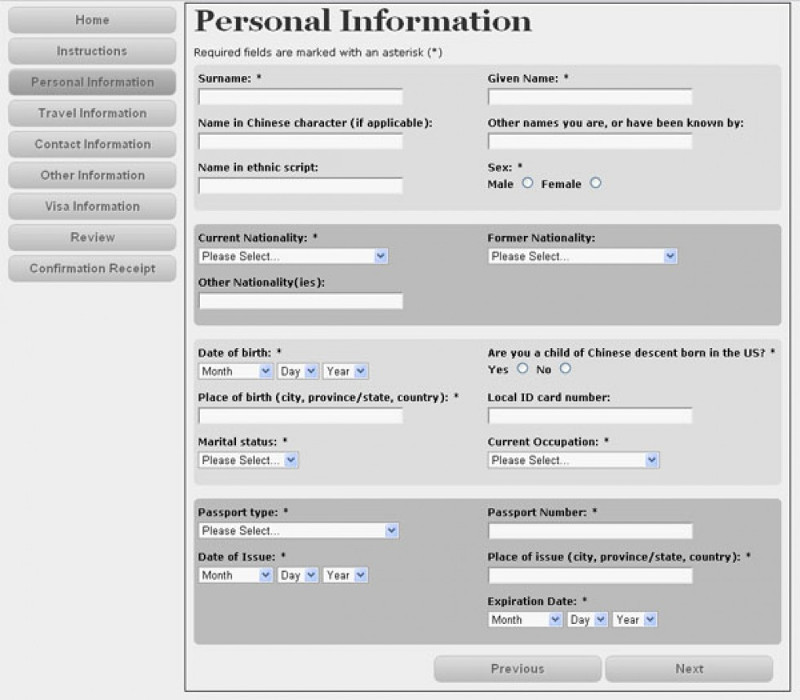

.. default-role:: code

===========================================
Automation for the Win!
===========================================

| By: Randy Syring
| Twitter: @RandySyring
| Email: randy.syring@level12.io
| https://github.com/rsyring/

.. epigraph::
    Impassioned Software Craftsmanship

.. image:: _static/level12-logo.png

.. note::
  - Presentation title

Introduction
==============

.. image:: _static/level12-logo.png
    :align: right

I'm the Chief Executive Developer at `Level 12 <https://www.level12.io/>`_.

Level 12 is software development firm
specializing in web and data(base) projects tailor made for our customers.

Agile methodologies make our customers happy...really, really, happy.

Why should you care?

.. note::
  * I'm the founder of Level 12.  I've been working with databases and web applications for
    for over 15 years.
  * I've been working directly with customers on custom projects for about 12 years.
  * My customers aren't "big players."
  * They are generally naive about software development best practices.
  * They generally care about our responsiveness, product quality, and cost.
  * If we can make time for automation, it's likely you can too.

My "real world", YMMV
============================

- Methods & concepts refined over last 8 years
- Primarily involved with web & data(base) development
- Not operating *"at scale"*
- These are "Best Practices" and I'm a slow adopter
- Your context will differ, that's ok!

What's your real world?
=======================

.. rst-class:: build

  - Developer, QA, Management, or ?
  - Full or multi-stack developers?
  - Small business, medium business, enterprise, mammoth?
  - Have solid automated testing and processes in place?

.. note::
  - BUILD!!

This Presentation
=================

* Encouragement
* Technical summary of layers involved
* Questions

.. note::
  - NOT going to show in-depth config or coding
  - I really would like interaction
  - If you are one of those people that loves to answer questions, wait about 4 seconds and then
    feel free to hop in.  If I ask a question, it's probably not rhetorical.
  - If it was meant to be rhetorical, I might make fun of you a little, but...don't worry...
    I promise it's not personal.
  - Seriously, I want to get the thinking juices going.  Please speak up.
  - If you stump me, you can all laugh a bit, and don't worry, I won't take it personal.

Learning Curve Paralysis
========================

Technology fatigue is real, but this is worth it.

.. note::
  - technology fatigue is worst when?
  - Yes, at conferences!!!
  - Who has attended conferences before?  How many things do you actually follow up on?
  - One piece of advice: take one thing away from this conference that you will act on, maybe two.
  - This really, really, really is worth it.

My Goal?
===============

.. image:: _static/meme.jpg
   :class: fullpic

.. note::
  - NO!
  - I'm not on an automation bandwagon.
  - I have a long-term goals that dictate the necessity of automation.
  - But before I tell you more....

What's Your Goal?
=================

Seriously, what is/are the guiding principle(s) that govern how you build software?

My Real Goal
===============

To sustainably:

* Respond to change with minimal friction
* Frequently deliver highly functional software

-----------

Four components: flexibility, velocity, quality, & cost

.. note::
  - Find the four components in the goal.
  - Where is the tension?
  - What is this?  Yes, Agile.
  - Quick question: is Scrum agile?  Is Agile scrum?
  - Agile is not Scrum, I'm sorry if Scrum or any other agile methodology has been a bad experience
    for you.
  - Agile is a set of principles, Google Agile Manifesto for more info.
  - My goal is a distillation of the principles listed in the Agile Manifesto.
  - Remember the title of this talk.  This is my win!
  - Agree or Strongly Agree that this is a noble goal for just about any development team?

Delivering on that Goal
=======================

Without heavy use of automated processes, especially testing, a truly agile workflow is impossible.

.. note::
  - "truly agile workflow" --> my goal
  - Survey: generally agrees, generally disagrees, maybe
  - Note that there are two components that need to be automated: testing and processes

Let's talk about Tests!
=======================

.. rst-class:: build

- Are you testing your code?
- Do you have automated tests for your code?

.. note::
  - BUILD!!
  - How much of your time is spent testing functionality vs writing code?
  - If no, why?
  - If yes, % of production code covered by tests?
  - If yes, who writes those automated tests: developers or dedicated QA peeps?

Developers Need to Write Tests
==============================

If developers are not creating automated tests in parallel with the production code, a truly
agile workflow is unsustainable.

.. note::
  - Frequently deliver *highly functional software*
  - Highly functional software requires testing be done.
  - Most developers will manually test some of their code, but that's not enough to satisfy my
    goal.

Reasons
=============================

* Quick iterations and frequent changes cause bugs.
* If you want high-quality software, you have to test for and fix bugs.
* As code volume and complexity grows over time, it becomes impossible to
  manually verify all functionality.
* Without automation, the effort expended testing is wasted.

.. note::
  - Respond to change with minimal friction and frequently deliver highly functional software

Manual Testing is Unsustainable
==========================================

.. image:: _static/code-ratio.png
   :class: fullpic

.. note::
  - How hard is it to manually test just the new functionality or bug fixes?
  - How much regression testing can be done?
  - If you have QA staff for this, is it reasonable to expect them to cover all the old
    functionality?
  - Over time, regression testing will cover less and less code or the testing will just stop
    being done.

Manual Testing is a Losing Battle
==================================

.. image:: _static/pisa.jpg
   :class: fullpic

.. note::
  - This is unsustainable
  - Remember my goal: To sustainably respond to change with minimal friction and frequently deliver
    highly functional software

Testing: Asset or Expense
=============================

- Manual testing is an expense
- Automated testing is mostly an asset, with maintenance related expenses

Automated Testing Saves Time
============================

No...really.

In both the short-term and the long-term.

.. note::
  - Why don't you test...it takes too much time.

I Don't Need No Stink'n Tests
==============================

.. image:: _static/simple-form.png
   :class: fullpic

I Don't...Need....ummm...help?
==============================

.. note::
  - Yes, this is a little self-serving, we don't see that many forms that look like this.
  - But, doesn't the complexity of the software we are building more often resemble this example?

Time Savings Overall
===============================

.. image:: _static/roi-graph.png
   :class: fullpic

.. note::
  - Does manual testing really get done thoroughly?  We've already said that's unlikely.
  - But I believe the graph still holds true because as software matures, if manual testing is
    relied upon, the software development process becomes increasingly brittle and error prone,
    slowing down developers, and forcing the organization to invest lots of time into manually
    ensuring the software is not broken.
  - That can affect developers, QA staff, management, and customers as releases are delayed and
    even simple changes take months to get released.

A Final Plea
============

* Manual testing is not sustainable, code quality will continually decrease as complexity increases.
* You are already testing, capture the value!
* Use devs for what they are good at (writing code to deal with repetition)
* Use QA peeps for what they are good at (break it!, UI/UX, non-repetitive)
* Just get started.  An object at rest...
* Keep at it, it will become natural

CI without Automated Tests
==========================

Neutered.

.. note::
  - If you don't have a quality test suite in place, start with that.
  - We operated for years with automated tests that ran on the dev's machine (not CI)
  - Your largest ROI will be in building the test suite, I can't really emphasize that enough.

I Practice What I Preach
============================
.. csv-table::
   :header: "", "Proj A", "Proj B"
   :widths: 35, 35, 35

   "Age", "6+ years", 1.5 years
   "Python Tests", "8,294", "1,444"
   "JS Tests", 309, 0
   "DB Tables", 200+, 35+
   "Python LoC", "145K", "26.5K"
   "Python Test LoC", "61K (42%)", "14.7K (55%)"
   "Code Coverage", 95%, 96%
   "Test Time", 39:04 (/4), 6:58

Release interval: whenever (multiple times per day if needed)

.. note::
  - This isn't bragging, I just want to show you that it is doable.
  - I also want to give you some stats.
  - Notice the % LOC.  Who thinks the % LOC seems like a waste?
  - Anyone part of a 6 year project without automated tests?  How often are your releases and how
    confident are you that you are not breaking things?

Delivering on my Goal (CI)
==========================

Without heavy use of automated processes, especially testing, a truly agile workflow is impossible.

.. note::
  - To sustainable respond to change with minimal friction and frequently deliver highly
    functional software.
  - And I'm arguing that that the statement above is true.
  - I've talked about the testing part, but now I'm switching focus to process and CI in particular.

Our Development Workflow
========================

* Development on Git branch (prefer small changes)
* PR for merge
* Review code diff
* Validate all tests pass
* Validate linting
* Validate code coverage
* Some changes require manual QA

.. note:
  - Does this seem reasonable?
  - Will this contribute significantly to my goal?
  - Do you do this?

Workflow Execution without Automation
=====================================

How likely is it that workflow will get executed for every commit if not automated?

.. note:
  - I've never met a developer that likes manual and repetitive tasks.
  - If he or she can't automate it, they will usually find a way to stop doing it.

Delivering on that Goal
=======================

Delivering on my goal: requires **automated testing and processes**, there is no other way.

Impossible to sustain manually!s

.. note::
  - To sustainable respond to change with minimal friction and frequently deliver highly
    functional software.

Workflow Review
========================

* Development on Git branch (prefer small changes)
* PR for merge
* Review code diff
* Validate all tests pass
* Validate linting
* Validate code coverage
* Some changes require manual QA

.. note::
  - Takes a good bit of work to do this manually.
  - Corners are likely to get cut.

Automated Workflow
=======================

.. image:: _static/gh-pr-snapshot.png
   :class: fullpic

More than a Process
===================

It's about culture.

Leadership needs to reinforce culture.

.. note::
  - Enforce it or don't do it.
  - Invest in making important things easy.

CI: Eat the Elephant
========================

Getting CI to run correctly is often frustrating.  Rabbit holes galore.

Focus on constant incremental improvements, building layer by layer.

Speaking of Layers
========================

- *Tests/Linting/Coverage in a Virtual Env*
- Dependencies
- Tox
- Docker
- CI (with Circle CI)
- Code Coverage
- Service Integration (Slack, GitHub, Email)

In Virtualenv
=======================

.. code-block:: console

  (pypicalc2)$ py.test pypicalc/
  ......................................
  38 passed in 0.12 seconds
  (pypicalc2)$ flake8 pypicalc/
  (pypicalc2)$

With Code Coverage
=======================

.. code-block:: console

  (pypicalc2)$ py.test --cov pypicalc --cov-config .coveragerc pypicalc/
  ......................................
  ---------------------------------- coverage: platform linux, python 3.5.2-final-0 -----------------------------------
  Name                                      Stmts   Miss Branch BrPart  Cover
  ---------------------------------------------------------------------------
  pypicalc/app.py                              11      0      0      0   100%
  pypicalc/cli.py                               8      0      0      0   100%

  ...<snip>...

  pypicalc/tests/test_web_request_3.py         27      6      4      0    68%
  pypicalc/tests/test_web_request_4.py         18      1      4      1    91%
  pypicalc/version.py                           1      0      0      0   100%
  pypicalc/views.py                            13      0      2      0   100%
  ---------------------------------------------------------------------------
  TOTAL                                       628    102    115     19    78%
  38 passed in 0.24 seconds

Speaking of Layers
========================

- Tests/Linting/Coverage in a Virtual Env
- *Dependencies*
- Tox
- Docker
- CI (with Circle CI)
- Code Coverage
- Service Integration (Slack, GitHub, Email)

Dependencies
=======================

.. code-block:: console

  $ tree requirements/
  requirements/
  ├── deployed-env.txt
  ├── dev-env.txt
  ├── includes
  │   ├── build-only.txt
  │   ├── ci.txt
  │   ├── common.txt
  │   ├── dev.txt
  │   └── install-only.txt
  ├── wheelhouse
  │   ├── appdirs-1.4.0-py2.py3-none-any.whl
  │   ├── arrow-0.7.0-py3-none-any.whl
  │   ├── ...<snip>...
  └── wheelhouse-build.txt

Speaking of Layers
========================

- Tests/Linting/Coverage in a Virtual Env
- Dependencies
- *Tox*
- Docker
- CI (with Circle CI)
- Code Coverage
- Service Integration (Slack, GitHub, Email)

Tox Summary
========================

* Creates virtualenvs
* Installs dependencies from wheelhouse
* Runs the tests w/ coverage
* Runs the linter
* Fails with a non-zero exit code if applicable

Tox
========================

.. code-block:: console

  $ tox
  py35 runtests: commands[0] | pip install -r requirements/deployed-env.txt
  Ignoring indexes: https://pypi.python.org/simple
  Collecting Keg (from -r requirements/includes/install-only.txt (line 1))
  ...<snip>...
  Installing collected packages: MarkupSafe, Jinja2, Werkzeug, itsdangerous, Flask, appdirs, blinker, pathlib, Click, wrapt, six, BlazeUtils, SQLAlchemy,
  ...<snip>...
  py35 runtests: commands[1] | py.test -c .ci/pytest.ini -ra --tb native --strict --cov pypicalc --cov-config .coveragerc --cov-report xml --no-cov-on-fail --junit-xml=/home/rsyring/projects/pypicalc2-src/.ci/test-reports/py35.pytests.xml pypicalc
  ================================================ test session starts ================================================
  platform linux -- Python 3.5.2, pytest-2.9.1, py-1.4.31, pluggy-0.3.1
  rootdir: /home/rsyring/projects/pypicalc2-src, inifile: .ci/pytest.ini
  plugins: cov-2.2.1
  collected 38 items

  pypicalc/tests/test_cli.py .
  ...<snip>...
  pypicalc/tests/test_web_request_4.py .

  ------------ generated xml file: /home/rsyring/projects/pypicalc2-src/.ci/test-reports/py35.pytests.xml -------------
  ---------------------------------- coverage: platform linux, python 3.5.2-final-0 -----------------------------------
  Coverage XML written to file coverage.xml
  ============================================= 38 passed in 0.30 seconds =============================================

  flake8 recreate: /home/rsyring/projects/pypicalc2-src/.tox/flake8
  flake8 installdeps: flake8
  flake8 runtests: commands[0] | flake8 pypicalc
  ______________________________________________________ summary ______________________________________________________
    py35: commands succeeded
    flake8: commands succeeded
    congratulations :)

Speaking of Layers
========================

- Tests/Linting/Coverage in a Virtual Env
- Dependencies
- Tox
- *Docker*
- CI (with Circle CI)
- Code Coverage
- Service Integration (Slack, GitHub, Email)

Docker
=======

The heart of the `docker-run-tests` script:

.. code-block:: bash

  docker run \
      -v $SRC_DPATH:/opt/src \
      -v $ARTIFACTS_DPATH:/opt/src/.ci/artifacts \
      -v $TEST_REPORTS_DPATH:/opt/src/.ci/test-reports \
      $DOCKER_FLAGS \
      level12/python-test-multi

Speaking of Layers
========================

- Tests/Linting/Coverage in a Virtual Env
- Dependencies
- Tox
- Docker
- *CI (with Circle CI)*
- Code Coverage
- Service Integration (Slack, GitHub, Email)

CI is So Simple!! ;)
========================

.. code-block:: yaml

  machine:
    services:
      - docker

  test:
    override:
      - /home/ubuntu/$CIRCLE_PROJECT_REPONAME/docker-run-tests

Speaking of Layers
========================

- Tests/Linting/Coverage in a Virtual Env
- Dependencies
- Tox
- Docker
- CI (with Circle CI)
- *Code Coverage*
- Service Integration (Slack, GitHub, Email)

Code Coverage w/ CodeCov
=========================
::

      py.test \
        ...<snip>...
        --cov pypicalc \
        --cov-config .coveragerc \
        --cov-report xml \
        --no-cov-on-fail \
        --junit-xml={toxinidir}/.ci/test-reports/{envname}.pytests.xml \
        pypicalc

.. code-block:: console

  $ ls .ci/test-reports/
  py35.pytests.xml

.. code-block:: yaml

  deployment:
    codecov:
      branch: /.*/
      commands:
        - bash <(curl -s https://codecov.io/bash) -t <token>

Code Coverage Result
=========================

.. image:: _static/codecov-snapshot.png
   :class: fullpic

`And More <https://codecov.io/github/rsyring/pypicalc2?branch=master>`_

Speaking of Layers
========================

- Tests/Linting/Coverage in a Virtual Env
- Dependencies
- Tox
- Docker
- CI (with Circle CI)
- Code Coverage
- *Service Integration (Slack, GitHub, Email)*

Service Integration: Slack
==========================

.. image:: _static/slack-screenshot.png
   :class: fullpic

Service Integration: GitHub
===========================

.. image:: _static/gh-pr-integration.png
   :class: fullpic

Questions?
======================

Thanks for attending.

| By: Randy Syring
| Twitter: @RandySyring
| Email: randy.syring@level12.io
| https://github.com/rsyring/

Image credits:

* `Image Credit <http://reqtest.com/testing-blog/you-cant-work-agile-without-automated-testing/>`_
* `Image Credit 2 <http://www.slideshare.net/lfingerman/test-automation-best-prcatices-with-soa-test-approach>`_
* `Example Project <http://reqtest.com/testing-blog/you-cant-work-agile-without-automated-testing/>`_
